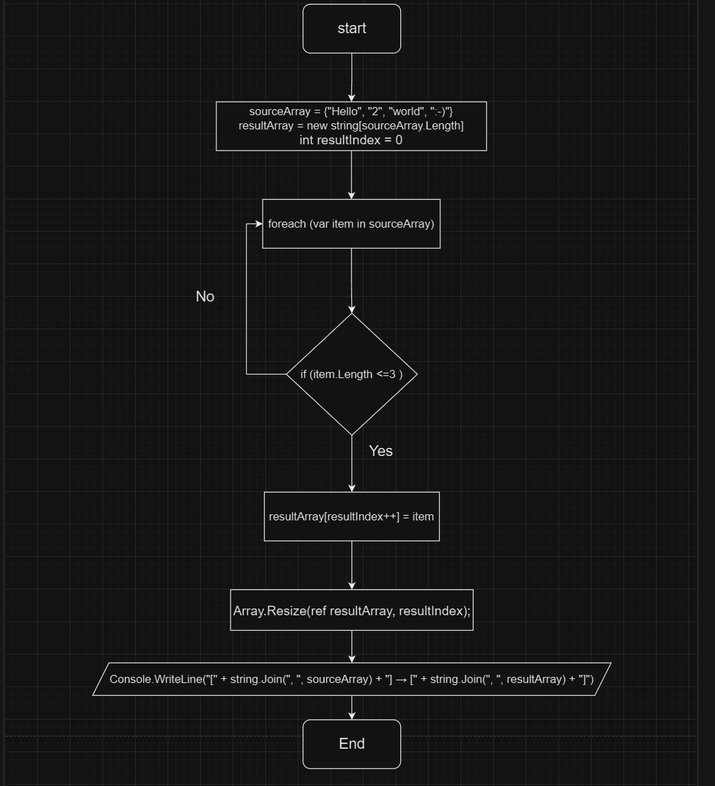

# Решение задачи фильтрации массива строк на C#

## Описание задачи

Программа фильтрует массив строк, оставляя только те строки, длина которых меньше или равна трем символам. Исходный массив может быть задан непосредственно в коде программы или введен пользователем во время выполнения.

## Техническое решение

### Алгоритм

1. Объявляем исходный массив строк.
2. Создаем результирующий массив того же размера, что и исходный.
3. Инициализируем переменную для отслеживания текущего индекса в результирующем массиве.
4. Используем цикл `foreach` для итерации по исходному массиву.
5. Проверяем длину каждой строки:
   - Если длина строки меньше или равна 3, добавляем строку в результирующий массив.
   - Увеличиваем индекс результирующего массива.
6. Используем `Array.Resize` для усечения результирующего массива до фактического количества добавленных строк.
7. Выводим результаты.

### Почему именно такое решение?

- Использование фиксированного массива соответствует условию задачи об избегании коллекций.
- `Array.Resize` помогает динамически изменить размер массива, что обычно невозможно с примитивными массивами в C#.
- Использование `foreach` позволяет читабельно и эффективно пройти по всем элементам массива.

### Блок Схема

